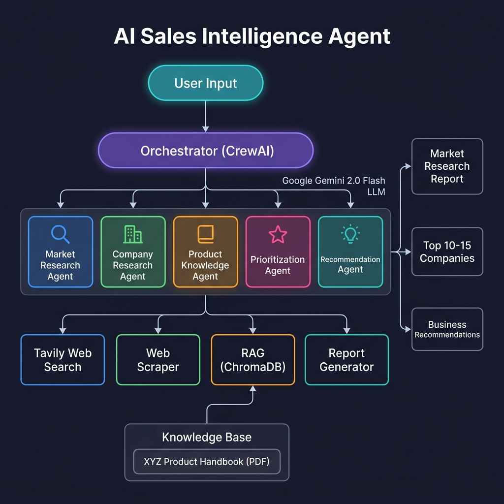

# 🤖 AI-Powered Sales Intelligence Agent
## XYZ Analytics Consulting — Automotive Industry

[](https://colab.research.google.com/)
[](https://www.python.org/)
[](https://www.crewai.com/)
[](https://ai.google.dev/)

---

## 📋 Project Overview

An AI-powered **Sales Intelligence Agent** built for **XYZ Analytics Consulting**, an automotive analytics consultancy. The agent automates B2B customer acquisition by researching the Indian automotive industry, identifying high-potential target companies, and recommending the most suitable consulting solutions.

### What the Agent Does

| Step | Agent | Description |
|------|-------|-------------|
| 1 | **Market Research Analyst** | Researches Indian automotive industry, identifies 25-30 candidate companies |
| 2 | **Company Intelligence Analyst** | Deep-dives into each company: profile, financials, challenges, news |
| 3 | **Solutions Architect** | Analyzes XYZ's services via RAG and creates solution-mapping guide |
| 4 | **Prioritization Advisor** | Scores and ranks companies, selects Top 10-15 |
| 5 | **Business Consultant** | Generates executive-ready recommendations for each target |

### XYZ Analytics Consulting Services

| Service | Description |
|---------|-------------|
| 🔧 **Warranty Analytics** | Early defect detection, claim cost reduction, recall prevention |
| 📦 **Supply Chain Risk Prediction** | Supplier monitoring, disruption simulation, risk scoring |
| 🏪 **Dealer & Field Service Intelligence** | Dealer scorecards, demand forecasting, service optimization |

---

## 🏗️ Architecture

### System Architecture Diagram



### Agent Workflow

```
┌─────────────┐
│  User Input  │  "Research Indian auto industry & recommend targets"
└──────┬──────┘
       │
       ▼
┌──────────────────────────────────────────────────────┐
│                 CREWAI ORCHESTRATOR                    │
│           Sequential Process | Memory Enabled          │
│              LLM: Google Gemini 2.0 Flash              │
└──────┬──────────┬──────────┬──────────┬─────────┬────┘
       │          │          │          │         │
       ▼          ▼          ▼          ▼         ▼
  ┌────────┐ ┌────────┐ ┌────────┐ ┌────────┐ ┌────────┐
  │Market  │ │Company │ │Product │ │Priori- │ │Recom-  │
  │Research│ │Research│ │Know-   │ │tization│ │mend-   │
  │Agent   │ │Agent   │ │ledge   │ │Agent   │ │ation   │
  │        │ │        │ │Agent   │ │        │ │Agent   │
  └───┬────┘ └───┬────┘ └───┬────┘ └───┬────┘ └───┬────┘
      │          │          │          │          │
  ┌───┴──────────┴──┐   ┌──┴──┐  ┌───┴──────────┴──┐
  │  Web Search +   │   │ RAG │  │  RAG + Web      │
  │  Web Scraper    │   │Tool │  │  Search          │
  └─────────────────┘   └──┬──┘  └─────────────────┘
                           │
                    ┌──────┴──────┐
                    │ ChromaDB    │
                    │ Vector DB   │
                    │ (Product    │
                    │  Handbook)  │
                    └─────────────┘
```

### Knowledge Retrieval (RAG) Pipeline

```
PDF Handbook → pdfplumber → Text Chunks → Google Embeddings → ChromaDB
                                                                  ↓
Agent Query → Query Embedding → Cosine Similarity Search → Top-K Chunks
```

---

## 🛠️ Technology Stack

| Component | Technology | Purpose |
|-----------|-----------|---------|
| **Agent Framework** | CrewAI | Multi-agent orchestration |
| **LLM** | Google Gemini 2.0 Flash | Reasoning and generation |
| **Embeddings** | Google text-embedding-004 | Document vectorization |
| **Vector Store** | ChromaDB | In-memory vector database |
| **Web Search** | Tavily API | Real-time web intelligence |
| **Web Scraping** | BeautifulSoup4 | Website content extraction |
| **PDF Parsing** | pdfplumber | Handbook text extraction |
| **Runtime** | Google Colab | Cloud notebook execution |

---

## 🚀 Setup & Run Instructions

### Prerequisites

1. **Google Gemini API Key** (free): [aistudio.google.com](https://aistudio.google.com)
2. **Tavily API Key** (free): [tavily.com](https://tavily.com)
3. **Product Handbook PDF**: `XYZ Analytics Consulting – Product & Solutions Handbook.pdf`

### Running on Google Colab

1. Open `Sales_Intelligence_Agent.ipynb` in Google Colab
2. Run the **Install Dependencies** cell (Section 1)
3. Enter your API keys when prompted (Section 2)
4. Upload the Product Handbook PDF when prompted (Section 3)
5. Run all remaining cells sequentially
6. View the generated reports in the Output section

### Using Colab Secrets (Recommended)

Instead of entering keys manually each time:
1. Go to Colab → 🔑 **Secrets** (left sidebar)
2. Add `GOOGLE_API_KEY` with your Gemini API key
3. Add `TAVILY_API_KEY` with your Tavily API key
4. The notebook will detect and use these automatically

---

## 📊 Expected Outputs

### 1. Market Research Report
- Indian automotive industry overview (market size, growth, GDP contribution)
- Key market trends (EV transition, supply chain challenges)
- Industry challenges relevant to analytics consulting

### 2. Company Profiles (25-30 companies)
- Company overview, products, manufacturing locations
- Financial highlights, recent news, growth trajectory
- Identified business challenges

### 3. Top 10-15 Prioritized Companies
- Weighted scoring across 5 criteria
- Selection rationale with business justification
- Balanced mix of OEMs, Tier-1 Suppliers, Component Manufacturers

### 4. Business Recommendations
For each shortlisted company:
- Executive summary
- Business challenges analysis
- Recommended consulting solution
- Expected business value (quantified)
- Engagement strategy

### 5. Architecture Diagram
- Agent workflow visualization
- Tool integration map
- RAG knowledge retrieval process

---

## 📁 Repository Structure

```
.
├── Sales_Intelligence_Agent.ipynb     # Main Colab notebook (run this!)
├── README.md                          # This file
├── requirements.txt                   # Python dependencies
├── architecture_diagram.png           # System architecture diagram
├── generate_notebook.py               # Notebook generator script
├── XYZ Analytics Consulting – Product & Solutions Handbook.pdf  # Knowledge base
├── Hackathon Guidelines.pdf           # Hackathon rules
└── Hackathon Problem Statement.pdf    # Problem statement
```

---

## ⚠️ Assumptions & Known Limitations

### Assumptions
- Company information is gathered from publicly available sources
- Financial data accuracy depends on the recency of web search results
- The agent uses the XYZ Product Handbook as the sole source for solution matching

### Limitations
- **API Rate Limits**: Tavily free tier allows 1000 searches/month; Gemini has per-minute quotas
- **Real-time Data**: Web search results may not reflect the very latest developments
- **Web Scraping**: Some websites may block automated access
- **Execution Time**: Full pipeline takes 10-20 minutes depending on API response times

---

## 📄 License

This project was built for the XYZ Analytics Consulting Hackathon (July 2026).

---

*Built with ❤️ using CrewAI, Google Gemini, and Tavily*
